# TapeAmp32 🎚️

> 🤖 **100% Vibe Coded** — built with AI assistance, zero shame.

Music player Android bergaya kaset klasik (VFD display, VU meter analog,
transport controls REW/PLAY/PAUSE/F.FWD) dengan DSP audio yang beneran
jalan — bukan cuma toggle kosmetik. Dibangun dari nol tanpa background
programming, sepenuhnya lewat AI-assisted development.

## Tentang

Saya bukan programmer. Semua kode di repo ini dikembangkan lewat kolaborasi
dengan AI — arsitektur, fitur, dan arah pengembangan saya yang tentukan;
implementasi detail dikerjakan AI. Nama **"Project Zero"** (`com.projectzero.tapeamp32`)
merefleksikan titik awal saya sebelum AI bikin development jadi mungkin
buat orang seperti saya.

## Fitur

### 🎧 Audio Engine
- **10-band parametric EQ** dengan preset custom (import/export sebagai JSON,
  kompatibel dengan format preset aplikasi EQ populer lain)
- **Vocal isolation** — shift bass & treble independen dari band EQ utama
- **Stereo balance & stereo expansion** (widening), plus mode Mono/Stereo
- **Soft limiter musical** — soft-knee, threshold sekitar -0.5 dBFS,
  stereo-linked, dengan **lookahead 3ms** supaya attack bisa dilonggarkan
  (3ms) tanpa risiko overshoot, **hold time 10ms** untuk mencegah gain
  reduction "gemetar" di transient beruntun, dan **release 120ms** untuk
  transisi yang halus/natural, bukan berdenyut (pumping)
- **Auto-preamp headroom management** — slider *MAX LOUDNESS ↔ SAFE HEADROOM*,
  atur sendiri trade-off antara loudness maksimal vs headroom aman per preset EQ
- **Bit-Perfect Mode** — matikan semua pemrosesan EQ/limiter, sinyal asli 1:1
- **ReplayGain otomatis per lagu** — mengukur RMS sample PCM asli saat lagu
  pertama diputar, menyimpan gain (dB) yang disarankan, diterapkan otomatis
  di pemutaran berikutnya biar level antar lagu rata (nonaktif otomatis saat
  Bit-Perfect Mode aktif)
- **Auto EQ per lagu** — preset EQ tersimpan otomatis per lagu, ganti sendiri
  begitu lagu itu diputar lagi
- **Crossfade** antar lagu (durasi bisa diatur)
- **Gapless playback**

### 📼 Player & UI
- Tampilan kaset klasik dengan reel berputar, VFD status panel, VU meter kiri/kanan
- Kontrol volume lewat swipe vertikal langsung di kaset
- Waveform seekbar — bar amplitude asli lagu, bisa di-tap/drag langsung untuk seek
- Lyrics screen (sinkron/tidak sinkron)
- Custom cassette skin & pilihan warna aksen tema (Gold Retro / Neon 80s / Silver Hi-Fi)
- Widget home-screen & kontrol dari notifikasi/lock screen

### 📚 Library & Import
- Import & scan file audio lokal ke library, dengan cache scan cepat
- Manajemen playlist
- Custom preset EQ per lagu

### 📡 Streaming
- Play stream URL custom (radio internet)
- Simpan & kelola daftar favorit stasiun

### ⚙️ Settings
- **Streaming & Network**, **UI & Appearance**, **Library**, **System**
  (Playback & Screen, Sleep Timer, Notifications, Language, About/Changelog),
  **Backup & Restore** (semua pengaturan sekaligus, bukan cuma preset EQ)
- **Multi-bahasa**: Ikuti Sistem / Bahasa Indonesia / English — ganti dari
  dalam app, terpisah dari bahasa sistem HP

## Screenshots

### Player & Equalizer

<p align="center">
  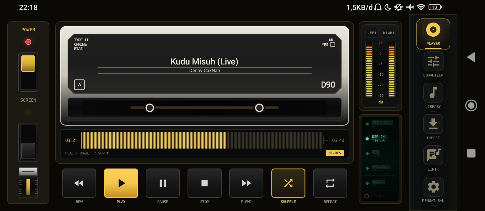
  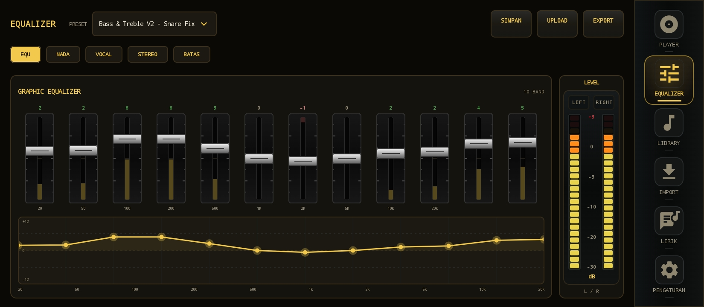
  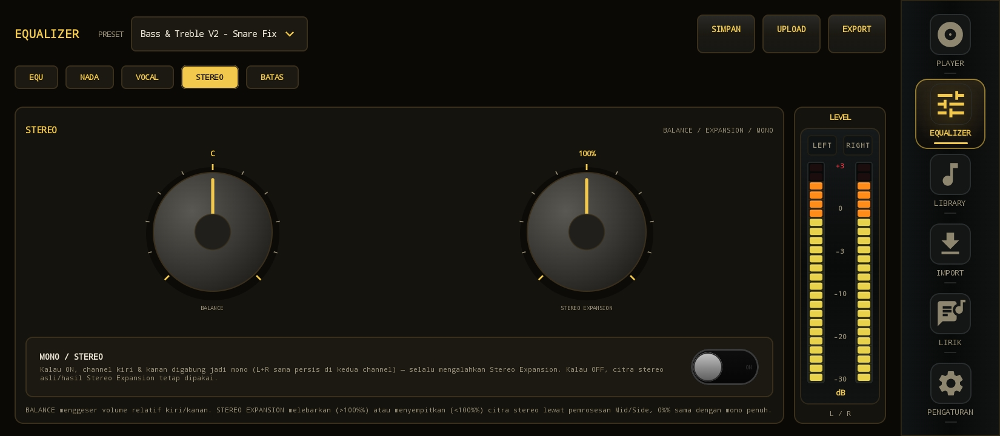
</p>
<p align="center">
  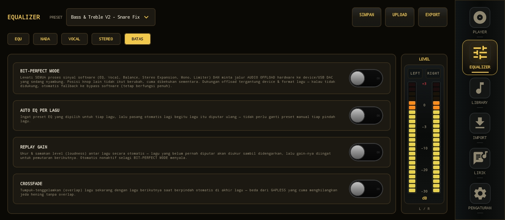
  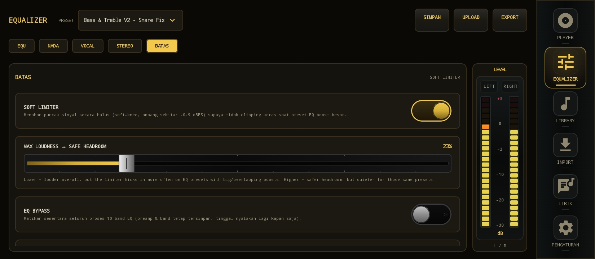
</p>

### Library, Import & Lirik

<p align="center">
  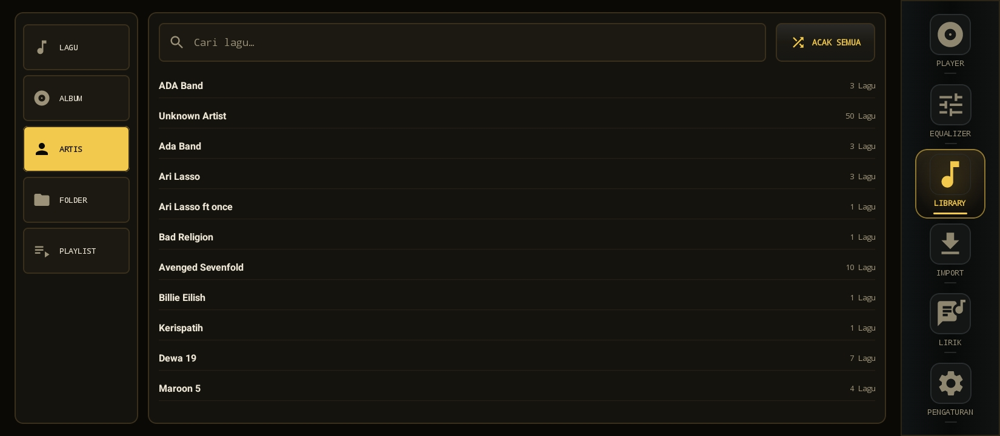
  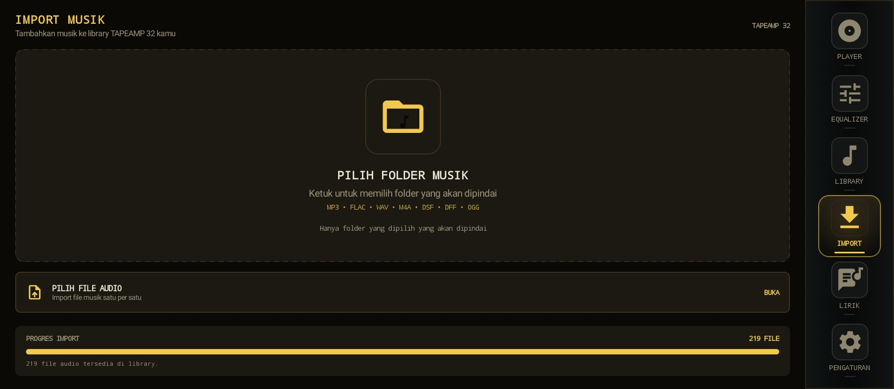
  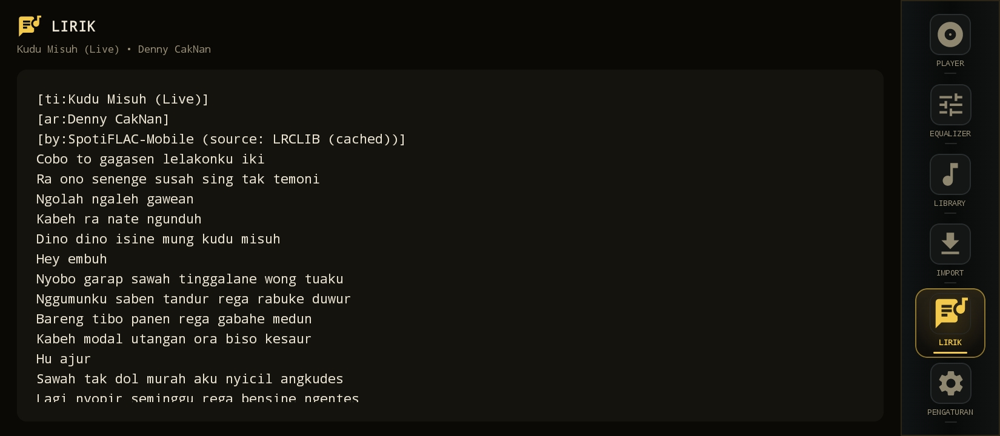
</p>

### Streaming

<p align="center">
  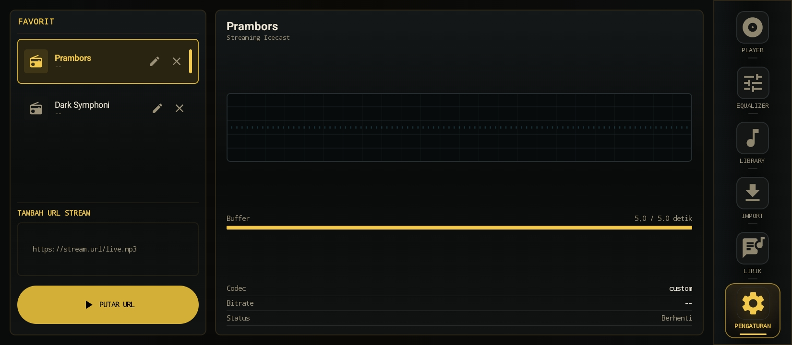
</p>

### Settings

<p align="center">
  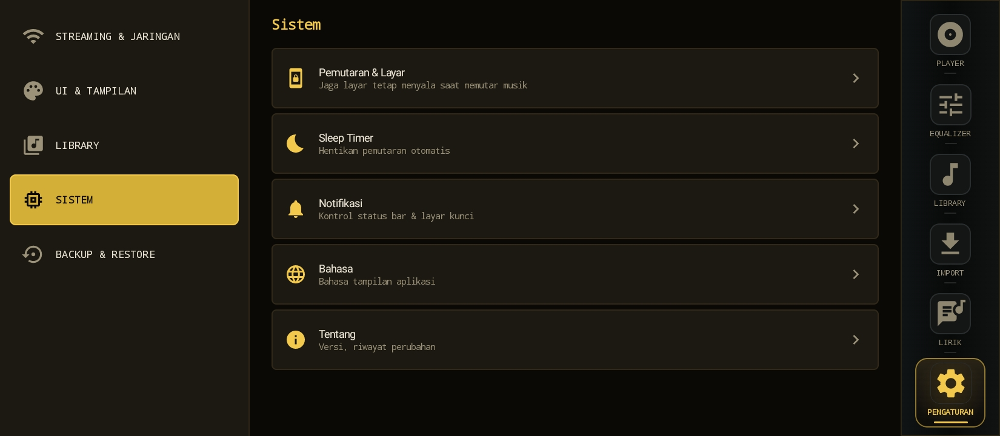
  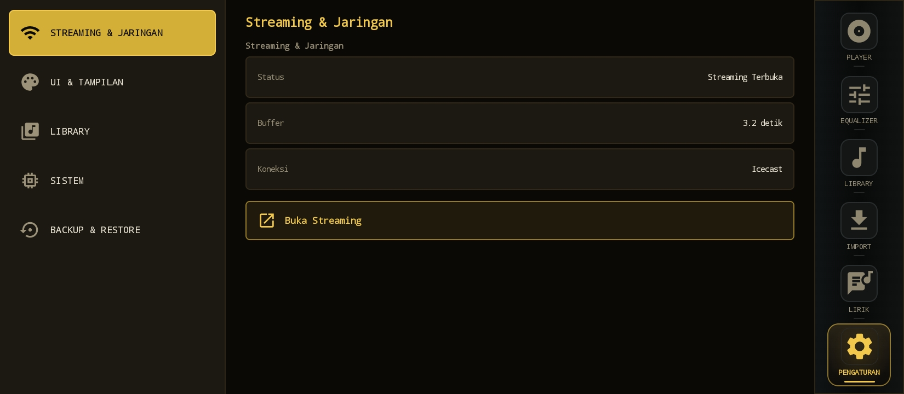
  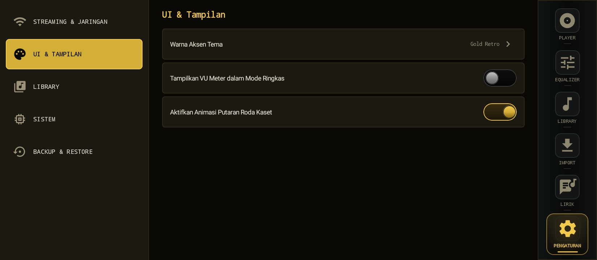
</p>
<p align="center">
  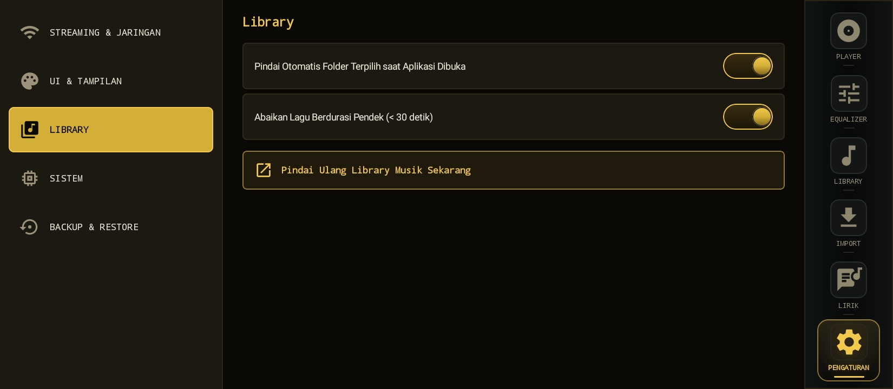
  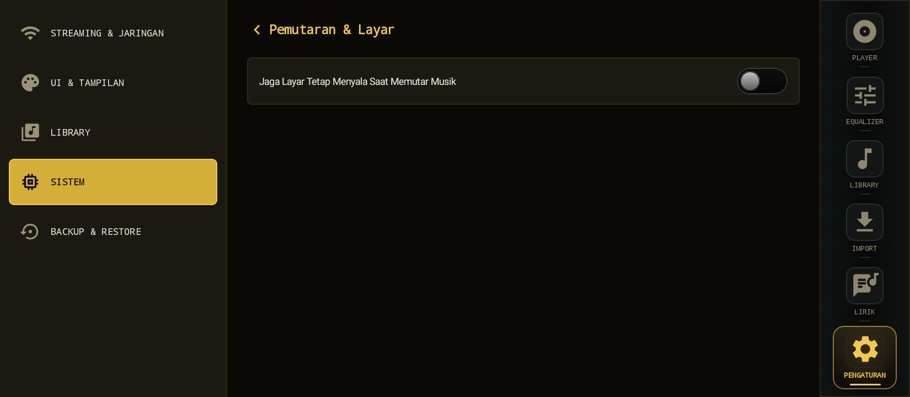
  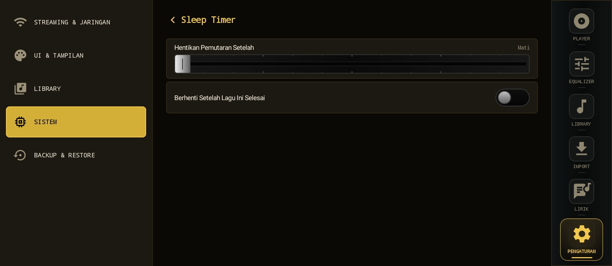
</p>
<p align="center">
  
  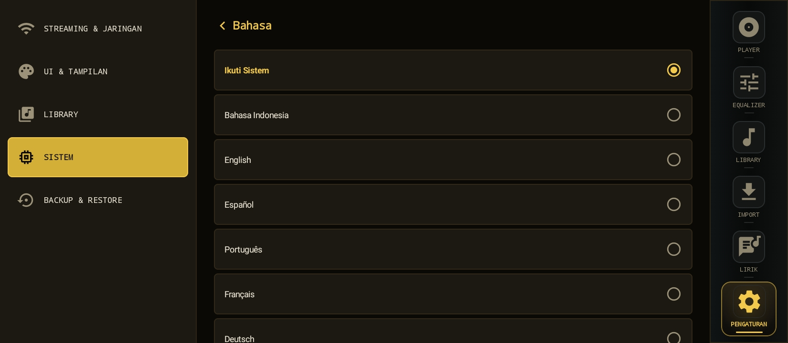
  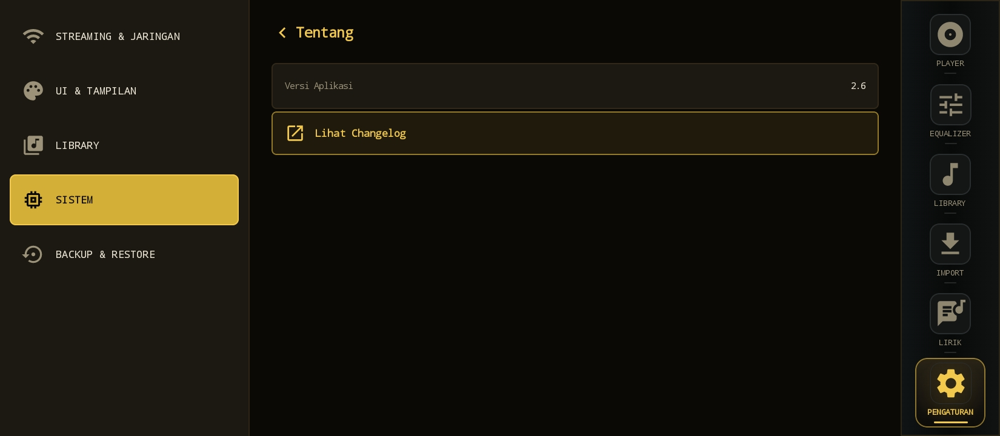
</p>
<p align="center">
  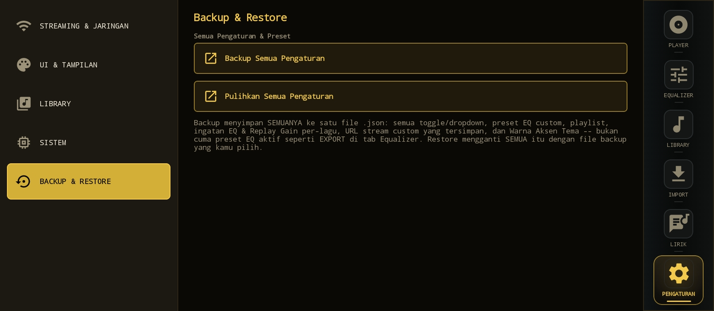
</p>

## Tech Stack

- **Kotlin** + **Jetpack Compose** (100% Compose, tanpa View/AppCompat)
- Audio processing custom (Biquad filter, parametric EQ, limiter dengan
  lookahead) — bukan library pihak ketiga
- DataStore untuk persist settings
- minSdk 26, targetSdk/compileSdk 34
- Arsitektur modular: tiap layar dipecah jadi beberapa file berdasarkan
  tanggung jawabnya (mis. `EqualizerScreen`, `EqualizerSubMenus`,
  `EqualizerVocalStereoMenus`, `EqualizerHeaderAndSliders`, dst.)

## Cara Build

### Opsi A — Android Studio (disarankan)

1. Clone/download repo ini
2. Buka folder project di **Android Studio** (versi terbaru yang
   support AGP 9.x & Kotlin 2.2.10)
3. Biarkan Gradle sync otomatis (Android Studio akan generate Gradle
   wrapper kalau belum ada)
4. Klik **Run ▶** untuk install ke device/emulator, atau
   **Build → Generate Signed Bundle/APK** untuk build APK rilis

### Opsi B — Command line

Repo ini belum menyertakan `gradlew` (Gradle wrapper script/jar). Kalau
mau build lewat terminal tanpa Android Studio:

```bash
# generate wrapper (butuh Gradle terinstall lokal, sekali saja)
gradle wrapper --gradle-version 9.5

# build debug APK
./gradlew assembleDebug

# APK hasil build ada di:
# app/build/outputs/apk/debug/app-debug.apk
```

### Requirement

- JDK 17+
- Android SDK dengan `compileSdk 34` terpasang
- Koneksi internet saat sync pertama kali (download dependency dari Google/Maven Central)

## Status

Masih aktif dikembangkan — versi saat ini **2.6**. Bug reports & feedback
welcome, tapi ingat: saya juga masih belajar cara baca kode saya sendiri 😅

Lihat `TapeAmp32_changelog.html` atau menu **Settings → System → About →
Changelog** di dalam app untuk riwayat lengkap tiap versi.

## Lisensi

Source code ini dipublikasikan untuk keperluan portofolio & pembelajaran.
Lihat file [LICENSE](./LICENSE) untuk ketentuan penggunaan lengkap —
singkatnya: boleh dilihat/dipelajari, **tidak untuk didistribusikan ulang
atau dipublikasikan sebagai aplikasi terpisah** tanpa izin.
